# Webhook Setup Guide

This guide covers how to set up payment webhooks for Soulaan Coop, with support for both **direct webhooks** and **Hookdeck** (recommended).

## Why Hookdeck?

[Hookdeck](https://hookdeck.com) is a webhook infrastructure service that provides:

- 🔄 **Automatic retries** - Don't lose payments due to temporary outages
- 🐛 **Debugging tools** - Inspect, replay, and debug webhook events
- 🧪 **Testing** - Test webhooks locally without ngrok
- 📊 **Monitoring** - Track webhook health and performance
- 🚦 **Rate limiting** - Prevent overwhelming your server
- 🔐 **Security** - Additional signature verification layer

---

## Option 1: Direct Stripe Webhooks (Default)

### Setup Steps

1. **Configure Environment Variables**

```bash
# In apps/api/.env or your deployment platform
STRIPE_SECRET_KEY=sk_live_xxx...
STRIPE_WEBHOOK_SECRET=whsec_xxx...
USE_HOOKDECK=false  # or leave unset
```

2. **Configure Stripe Dashboard**

   a. Go to [Stripe Dashboard → Webhooks](https://dashboard.stripe.com/webhooks)
   
   b. Click "Add endpoint"
   
   c. Enter your webhook URL:
   ```
   https://www.soulaancoop.com/api/webhooks/stripe
   ```
   
   d. Select these events:
   - ✅ `payment_intent.succeeded`
   - ✅ `payment_intent.payment_failed`
   - 📋 `charge.succeeded` (optional, for monitoring)
   - 📋 `charge.refunded` (optional, for refunds)
   
   e. Copy the **Signing secret** (starts with `whsec_`)
   
   f. Set it as `STRIPE_WEBHOOK_SECRET` in your environment

3. **Test the Webhook**

```bash
# Use Stripe CLI to forward webhooks to localhost
stripe listen --forward-to http://localhost:3001/webhooks/stripe

# Trigger a test payment
stripe trigger payment_intent.succeeded
```

---

## Option 2: Hookdeck (Recommended for Production)

### Setup Steps

1. **Create Hookdeck Account**

   - Sign up at [hookdeck.com](https://hookdeck.com)
   - Free tier supports 100K requests/month

2. **Create a Hookdeck Connection**

   a. In Hookdeck dashboard, create a new connection:
   
   - **Source**: Stripe
   - **Destination**: Your API endpoint
     ```
     https://www.soulaancoop.com/api/webhooks/stripe
     ```
   
   b. Hookdeck will provide a **Webhook URL** like:
   ```
   https://events.hookdeck.com/e/src_xxxxxxxxx
   ```

3. **Configure Stripe Dashboard**

   a. Go to [Stripe Dashboard → Webhooks](https://dashboard.stripe.com/webhooks)
   
   b. Click "Add endpoint"
   
   c. Enter the **Hookdeck webhook URL**:
   ```
   https://events.hookdeck.com/e/src_xxxxxxxxx
   ```
   
   d. Select these events:
   - ✅ `payment_intent.succeeded`
   - ✅ `payment_intent.payment_failed`
   - 📋 `charge.succeeded` (optional)
   - 📋 `charge.refunded` (optional)

4. **Configure Environment Variables**

```bash
# In apps/api/.env or your deployment platform
STRIPE_SECRET_KEY=sk_live_xxx...
USE_HOOKDECK=true
HOOKDECK_SIGNATURE_KEY=xxxxx  # Optional: Get from Hookdeck dashboard
```

5. **Optional: Enable Hookdeck Signature Verification**

   For extra security, verify requests are from Hookdeck:
   
   a. In Hookdeck dashboard, go to your destination settings
   
   b. Enable "Signing Secret"
   
   c. Copy the secret
   
   d. Set it as `HOOKDECK_SIGNATURE_KEY` in your environment

### Testing with Hookdeck

1. **Local Development**

   Hookdeck CLI forwards webhooks to localhost:
   
   ```bash
   # Install Hookdeck CLI
   npm install -g hookdeck-cli
   
   # Login
   hookdeck login
   
   # Forward webhooks to local server
   hookdeck listen 3001 stripe-source
   ```

2. **Test in Hookdeck Dashboard**

   - Go to "Requests" tab
   - Click "Retry" on any event to replay it
   - Use "Simulate Event" to create test events

---

## Environment Variables Reference

| Variable | Required | Description |
|----------|----------|-------------|
| `STRIPE_SECRET_KEY` | ✅ Always | Your Stripe secret key (starts with `sk_`) |
| `STRIPE_WEBHOOK_SECRET` | ⚠️ Direct only | Webhook signing secret (starts with `whsec_`) |
| `USE_HOOKDECK` | ⚠️ For Hookdeck | Set to `true` to use Hookdeck mode |
| `HOOKDECK_SIGNATURE_KEY` | ❌ Optional | For additional Hookdeck signature verification |

---

## Webhook Events

### Payment Success Flow

```mermaid
sequenceDiagram
    User->>Stripe: Makes payment
    Stripe->>Hookdeck/Direct: payment_intent.succeeded
    Hookdeck/Direct->>API: Verified webhook
    API->>Database: Find transaction
    API->>Blockchain: Mint UC tokens
    API->>Database: Mark completed
    API->>User: Tokens in wallet ✅
```



### Handled Events

| Event | When Fired | Action |
|-------|------------|--------|
| `payment_intent.succeeded` | Payment successful | Mints UC tokens to user |
| `payment_intent.payment_failed` | Payment failed | Marks transaction as FAILED |

---

## Troubleshooting

### Direct Webhooks

**Problem**: "Invalid signature" error

**Solutions**:
- Verify `STRIPE_WEBHOOK_SECRET` matches Stripe dashboard
- Ensure you're using `express.raw()` middleware (already configured)
- Check webhook endpoint URL is correct

**Problem**: Webhooks not arriving

**Solutions**:
- Check Stripe dashboard webhook logs
- Verify firewall allows Stripe IPs
- Check server logs for errors

### Hookdeck

**Problem**: Events not forwarding

**Solutions**:
- Check Hookdeck dashboard "Issues" tab
- Verify destination URL is correct and accessible
- Check Hookdeck retry settings

**Problem**: Events delayed

**Solutions**:
- Check Hookdeck rate limiting settings
- Upgrade Hookdeck plan if hitting limits
- Review retry configuration

---

## Monitoring

### Stripe Dashboard
- View webhook attempts: [Dashboard → Webhooks](https://dashboard.stripe.com/webhooks)
- Check event logs for failures
- See retry attempts

### Hookdeck Dashboard (if using)
- Real-time event monitoring
- Request/response inspection
- Delivery metrics and alerts
- Retry history

### Application Logs
```bash
# Watch API logs
pnpm --filter @soulaan-coop/api start

# Look for:
# ✅ "Stripe webhook signature verified"
# ✅ "UC minted, tx hash: 0x..."
# ✅ "Transaction marked as COMPLETED"
# ❌ Any errors during processing
```

---

## Security Best Practices

1. ✅ **Always verify signatures** - Don't trust webhook data without verification
2. ✅ **Use HTTPS** - Never use HTTP in production
3. ✅ **Check idempotency** - Prevent duplicate processing (already implemented)
4. ✅ **Rate limiting** - Use Hookdeck or implement your own
5. ✅ **Monitor failed webhooks** - Set up alerts for failures
6. ✅ **Keep secrets secure** - Never commit webhook secrets to git
7. ✅ **Test thoroughly** - Use Stripe CLI or Hookdeck to test edge cases

---

## Migration Between Options

### From Direct → Hookdeck

1. Set up Hookdeck connection (see Option 2)
2. Update Stripe webhook URL to Hookdeck URL
3. Update environment variables:
   ```bash
   USE_HOOKDECK=true
   ```
4. STRIPE_WEBHOOK_SECRET no longer needed (but keep for local testing)

### From Hookdeck → Direct

1. Get webhook secret from Stripe dashboard
2. Update environment variables:
   ```bash
   USE_HOOKDECK=false
   STRIPE_WEBHOOK_SECRET=whsec_xxx...
   ```
3. Update Stripe webhook URL to direct endpoint
4. Test thoroughly before full migration

---

## Support

- **Stripe Docs**: https://stripe.com/docs/webhooks
- **Hookdeck Docs**: https://hookdeck.com/docs
- **Stripe CLI**: https://stripe.com/docs/stripe-cli
