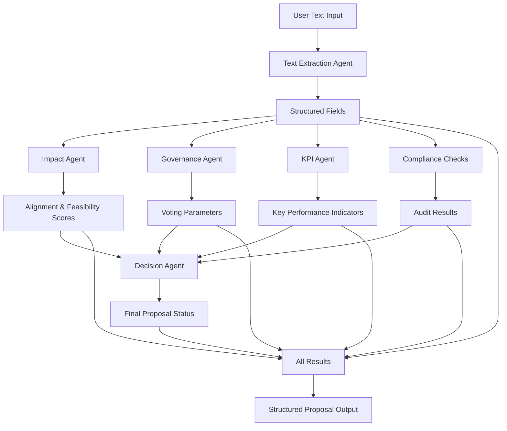

# Proposal Engine - AI Agent Architecture

The Proposal Engine uses a multi-agent system powered by OpenAI's Agent SDK to process cooperative proposals from simple text input into structured, analyzed outputs with charter goal optimization and alternative generation.

## 🤖 Agent Architecture Overview

The system employs 7 specialized AI agents that work together to analyze, score, and process proposals:



## 🔄 Processing Flow

### 1. **Text Extraction Agent** 
*Converts raw text into structured data*

**Input:** Raw proposal text (20-10,000 characters)
```
"I want to build solar panels on our community center. This will cost $15,000 and save us money..."
```

**Output:** Structured fields
- **Title**: Extracted or generated (5-140 chars)
- **Summary**: Condensed description (20-1000 chars)  
- **Category**: business_funding, infrastructure, transport, etc.
- **Budget**: Currency and amount extracted from text
- **Treasury Plan**: Suggested local/national fund distribution
- **Impact**: Economic estimates (leakage reduction, jobs, timeline)
- **Region/Proposer**: Inferred from context if mentioned

**Capabilities:**
- 🔍 Web search for market data validation
- 💰 Financial amount extraction with regex parsing
- 🏷️ Category classification from proposal content
- 📊 Impact estimation based on comparable projects

---

### 2. **Impact Agent**
*Scores proposal alignment and feasibility*

**Input:** Extracted structured fields
**Output:** Numerical scores (0.0 - 1.0)
- **Alignment**: How well proposal fits cooperative mission
- **Feasibility**: Execution risk and delivery capacity assessment  
- **Composite**: Average of alignment and feasibility

**Analysis Process:**
- 🔍 Web research on similar projects and market conditions
- 📈 Benchmarking against comparable case studies
- 🎯 Mission alignment evaluation
- ⚖️ Risk assessment based on budget and scope

---

### 3. **Governance Agent**
*Sets democratic voting parameters*

**Input:** Extracted fields (especially budget and category)
**Output:** Voting configuration
- **Quorum Percent**: Minimum participation (default 20%)
- **Approval Threshold**: Required yes votes (default 60%)
- **Voting Window**: Days to vote (default 7)

**Logic:**
- 💰 Higher budgets → Higher thresholds (>$1M = 25% quorum, 65% approval)
- 🏛️ Governance proposals → Extended voting periods
- 🔍 Research cooperative governance best practices

---

### 4. **KPI Agent** 
*Suggests measurable success metrics*

**Input:** Proposal details and category
**Output:** Up to 3 Key Performance Indicators
- **Name**: Metric description
- **Target**: Numerical goal
- **Unit**: USD, UC, jobs, percent, count

**Examples:**
- Export revenue: 100,000 USD
- Jobs created: 5 jobs  
- Local spend retained: 750,000 USD

---

### 5. **Decision Agent**
*Determines final proposal status*

**Input:** All agent outputs + compliance results
**Output:** Status decision
- `draft` - Needs refinement
- `votable` - Ready for community vote
- `approved` - Automatically approved
- `rejected` - Failed compliance/feasibility
- `funded` - Approved and funded

**Decision Logic:**
- ❌ Any critical compliance failure → `rejected`
- ✅ High scores + good feasibility → `votable` or `approved`
- ⚠️ Uncertain cases → `draft` (conservative default)
- 🔍 Web search for precedents and risk factors

## 🛡️ Compliance & Safety

**Automated Compliance Checks:**
- ✅ Treasury allocation sums to 100%
- 🚫 Excluded sector detection (fashion, restaurants, etc.)
- 🔒 Prompt injection / manipulation attempt detection  
- ⚠️ Unrealistic claims flagging ("guaranteed profit", "risk-free")
- 📋 Charter compliance verification

## 🔧 Technical Implementation

**Built With:**
- **OpenAI Agent SDK** - Multi-agent orchestration
- **GPT-4.1-mini** - Language model for all agents
- **Web Search Tool** - Real-time market research
- **Zod Schemas** - Type-safe structured outputs
- **TypeScript** - Full type safety

**Key Features:**
- 🔄 **Parallel Processing**: Impact, Governance, and KPI agents run simultaneously
- 🌐 **Web Research**: All agents can search for current market data
- 🔒 **Structured Outputs**: OpenAI structured outputs ensure valid JSON
- 🧪 **Test Mode**: Mock agents for fast testing without API calls
- 📊 **Comprehensive Auditing**: Every decision is logged and traceable

## 📊 Input/Output Examples

### Simple Input
```typescript
{
  text: "Community solar panel installation for $25,000 to reduce electricity costs by $200/month"
}
```

### Rich Output  
```typescript
{
  id: "prop_Abc123",
  title: "Community Solar Panel Installation", 
  summary: "Install solar panels to reduce electricity costs...",
  category: "infrastructure",
  budget: { currency: "USD", amountRequested: 25000 },
  treasuryPlan: { localPercent: 70, nationalPercent: 30, acceptUC: true },
  impact: { leakageReductionUSD: 2400, jobsCreated: 2, timeHorizonMonths: 12 },
  scores: { alignment: 0.85, feasibility: 0.78, composite: 0.815 },
  governance: { quorumPercent: 20, approvalThresholdPercent: 60, votingWindowDays: 7 },
  status: "votable",
  audit: { engineVersion: "proposal-engine@agents-1.0.0", checks: [...] }
}
```

## 🚀 Usage

```typescript
import { proposalEngine } from "@repo/validators";

const result = await proposalEngine.processProposal({
  text: "Your proposal description here...",
  proposer: { wallet: "0x...", role: "member" }, // optional
  region: { code: "US", name: "United States" }   // optional
});
```

The engine handles everything else automatically through intelligent AI agent collaboration! 🤖✨

